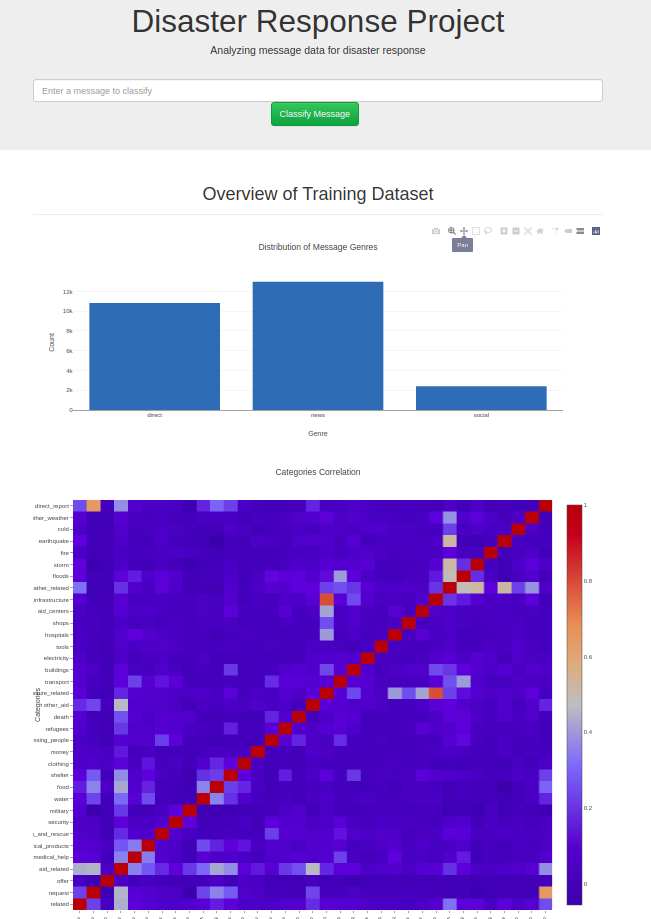
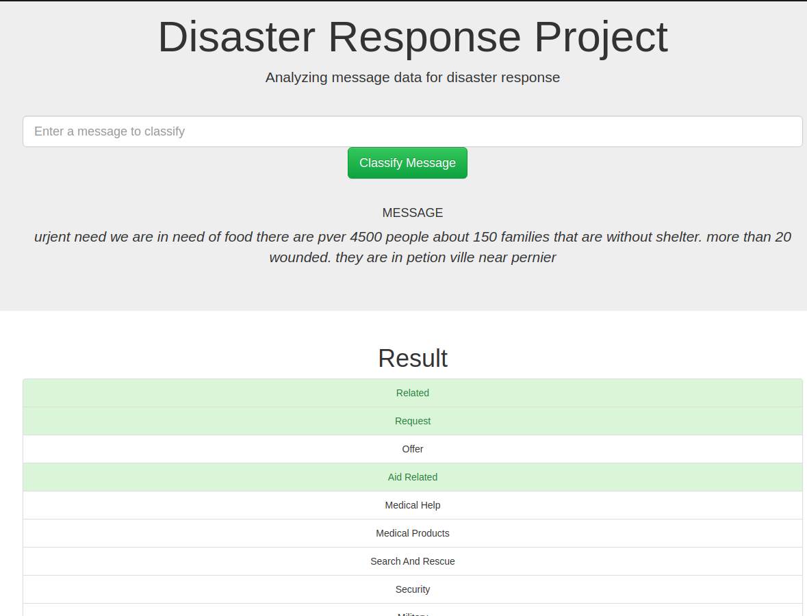

## Table of Contents

1. [Description](#description)
2. [Dependencies](#dependencies)
3. [Installing](#installing)
4. [Executing Program](#executing)
5. [Screenshots](#screenshots)

# Disaster Response Pipeline Project

## Description

Part of Udacity Data Scientist nanodegree project
the aim is to build a model using machine learning techniques with the provided data

### Libraries used

1. SQLalchemy
2. NumPy
3. SciPy
4. Pandas
5. Sciki-Learn
6. NLTK
7. Flask, Plotly

### Executing Program:
1. Run the following commands in the project's root directory to set up your database and model.

    - To run ETL pipeline that cleans data and stores in database
        `python data/process_data.py data/disaster_messages.csv data/disaster_categories.csv data/DisasterResponse.db`
    - To run ML pipeline that trains classifier and saves
        `python models/train_classifier.py data/DisasterResponse.db models/classifier.pkl`

2. Run the following command in the app's directory to run your web app.
    `python run.py`

3. Go to http://0.0.0.0:3001/

## Screenshots

1. **The main page**

   
   
2. ** Main page graphs **

  

3. **This is an example of a message testing Machine Learning model performance**

